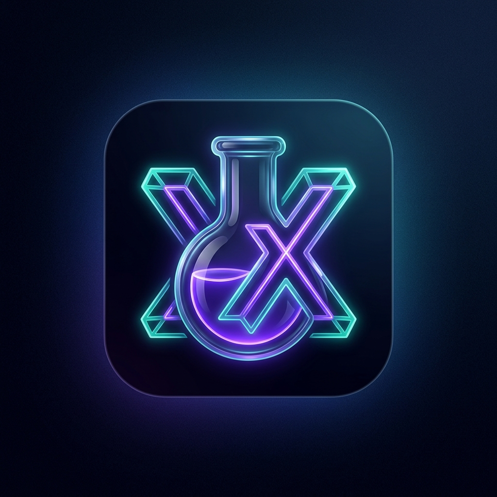

<p align="center">
  
</p>

<h1 align="center">OpenLabX</h1>

<p align="center">
  
  
  
  
  
  
  
</p>

<p align="center">
  <strong>An open-source, community-driven, offline-first mobile platform that allows users to download and run interactive educational simulations, calculators, and study guides.</strong>
</p>

Developers can build these lightweight **"Labs"** using standard HTML5, CSS, and JavaScript, package them as extensions, and distribute them via the OpenLabX Marketplace.

---

## 1. Core Architecture

The system consists of three main components:
1. **The Host App (Mobile):** Built with a cross-platform framework (Flutter), serving as the secure container, repository manager, and sandboxed runner.
2. **The Marketplace Backend:** Storing metadata of "Labs" (ratings, category, author info) and the actual compiled package zip files.
3. **The Developer SDK & Specification:** Standards and schemas that web developers follow to package their interactive tools and ensure host-app compatibility.

### System Workflow Diagram

```mermaid
graph TD
    subgraph Developer [1. Developer Environment]
        A["Standard Web Assets (HTML5, CSS, JS)"] --> B["manifest.json Metadata"]
        B --> C["Package into .olx Zip Archive"]
    end

    subgraph Marketplace [2. OpenLabX Marketplace Backend (Supabase)]
        D["Supabase Storage (Stores .olx files)"]
        E["PostgreSQL DB (Metadata, Ratings, Creators)"]
    end

    subgraph HostApp [3. OpenLabX Host App (Mobile Container)]
        F["In-App Marketplace Browser"] --> G["Lab Downloader / Manager"]
        G --> H["Secure Extraction & Sandbox Storage"]
        H --> I["Isolated Local WebView (Offline Run)"]
    end

    C -- "Uploads .olx" --> Marketplace
    Marketplace -- "Downloads Zip & Metadata" --> HostApp
```

---

## 2. Key Features

### A. The Host App (Client-Side)
*   **Offline-First Execution:** Once a Lab is downloaded, it executes entirely on-device without requiring an active internet connection.
*   **Local Sandboxed WebView:** A highly secure internal browser instance (`flutter_inappwebview`) loading local resources via local servers or secure schemes to prevent cross-origin exploits.
*   **Lab Manager (Dashboard):**
    *   Displays installed Labs in a responsive grid.
    *   Allows users to delete, update, or pin favorite Labs.
    *   Provides analytical info like storage size on disk.
*   **Local Storage Sync:** Allows local HTML labs to save high scores, configurations, or progress using the browser's `localStorage` or `IndexedDB` API, safely isolated from other Labs.

### B. The OpenLabX Marketplace (In-App)
*   **Curated Directory:** Browse and filter labs by categories (e.g., *Physics, Chemistry, Mathematics, Toolkits, Engineering*).
*   **Community Reviews & Ratings:** Users can leave feedback, rate labs, and report buggy or malicious content.
*   **Creator Profiles:** Showcases the developers who created the simulations with quick links to their GitHub profiles and portfolio listings.

### C. Developer Ecosystem (The Extension Standard)
*   **Standard Web Stack:** Zero friction for web developers. If you can build a responsive webpage using HTML, CSS, and JS, you can build an OpenLabX Lab.
*   **Manifest-Driven:** A simple `manifest.json` file describes the capabilities, entry points, and required permissions of the extension.

---

## 3. The `.olx` Extension Specification

A Lab is distributed as a compressed folder with the `.olx` extension (which is physically a standard `.zip` file).

### File Structure of a "Lab"
```text
my-awesome-simulation/
├── manifest.json
├── index.html
├── icon.png
├── css/
│   └── style.css
└── js/
    └── main.js
```

### The `manifest.json` Schema
Every lab must include this metadata file at its root level so the OpenLabX Host App knows how to register, verify, and launch it.

```json
{
  "id": "org.openlabx.physics.gravity_sim",
  "name": "Gravity & Orbit Simulator",
  "version": "1.0.2",
  "author": "Nuwan Perera",
  "github": "https://github.com/nuwanp",
  "description": "An interactive simulation showing how gravity affects planetary orbits. Uses formulas like $F = G \\frac{m_1 m_2}{r^2}$.",
  "category": "Physics",
  "entry_point": "index.html",
  "icon": "icon.png",
  "permissions": [
    "storage"
  ],
  "min_host_version": "1.0.0"
}
```

---

## 4. Security & Sandboxing

Running third-party JavaScript code on a user's mobile device requires strict guardrails:

> [!IMPORTANT]
> **Network Restrictions**
> By default, downloaded Labs run in a restricted mode. They cannot make fetch/XMLHttpRequest calls to external servers unless the `network` permission is explicitly requested and declared in the `manifest.json` file.

> [!WARNING]
> **Device Isolation**
> Labs operate in a pure sandbox environment. They do not have access to native device features or APIs (e.g., Camera, Contacts, SMS, Location, or local filesystem outside their sandbox directory).

> [!TIP]
> **Data Isolation**
> Each Lab is loaded using a unique origin or completely isolated directory path. This guarantees that **Lab A** can never access the `localStorage` or `IndexedDB` data of **Lab B**.

---

## 5. Recommended Tech Stack

*   **Mobile App (Host):**
    *   **Flutter:** Best for smooth UI rendering across iOS and Android. Leverages `flutter_inappwebview` for advanced local file serving, custom scheme handling, and security sandboxing.
*   **Backend (Marketplace & Storage):**
    *   **Supabase:** An open-source PostgreSQL database to handle queries for available Labs, metadata, user ratings, and **Supabase Storage** to store and serve the `.olx` package files.
*   **Developer CLI (Optional but Recommended):**
    *   **`olx-cli` (Node.js):** A lightweight utility developers run locally to validate their `manifest.json` structures, verify image constraints, and package directory structures into a conforming `.olx` file.
