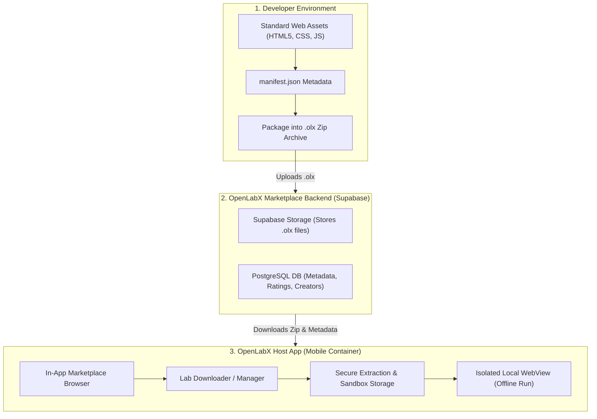

<p align="center">
  
</p>

<h1 align="center">OpenLabX</h1>

<p align="center">
  
  
  
  
  
  
  
</p>

<p align="center">
  <strong>An open-source, community-driven, offline-first mobile platform that allows users to download and run interactive educational simulations, calculators, and study guides.</strong>
</p>

Developers can build these lightweight **"Labs"** using standard HTML5, CSS, and JavaScript, package them as extensions, and distribute them via the OpenLabX Marketplace.

---

## 1. Core Architecture Overview

OpenLabX uses a Hybrid Micro-Frontend Architecture where a native wrapper (built with Flutter) serves as the host platform, orchestration layer, and security sandbox, while independent lightweight web-app packages (`.olx` files) run locally inside isolated WebViews.

### System Architecture Diagram
```text
+-------------------------------------------------------------------------+
|                           FLUTTER HOST APP                              |
|                                                                         |
|  +------------------------+  +------------------+  +-----------------+  |
|  |     UI & Dashboard     |  |   ZIP Extractor  |  |  Local Storage  |  |
|  |   (Flutter Widgets)    |  |    (Archive)     |  |  (Isar / Hive)  |  |
|  +-----------+------------+  +--------+---------+  +--------+--------+  |
|              |                        |                     |           |
|              | Launches               | Saves Files         | Interacts |
|              v                        v                     v           |
|  +-------------------------------------------------------------------+  |
|  |                    LOCAL WEBVIEW CONTROLLER                       |  |
|  |               (InAppWebView / Local HTTP Server)                  |  |
|  |                                                                   |  |
|  |  +-------------------------------------------------------------+  |  |
|  |  |                      SECURE SANDBOX                         |  |  |
|  |  |                                                             |  |  |
|  |  |   [ HTML5 Simulation / Lab ]                                |  |  |
|  |  |   Loads via: http://localhost:8080/labs/{lab_id}/index.html  |  |  |
|  |  |                                                             |  |  |
|  |  |   +-----------------------------------------------------+   |  |  |
|  |  |   |           openlabx-bridge.js (Injected)             |   |  |  |
|  |  |   |  Allows bridge calls: window.flutter_inappwebview   |   |  |  |
|  |  |   +-----------------------------------------------------+   |  |  |
|  |  +-------------------------------------------------------------+  |  |
|  +-------------------------------------------------------------------+  |
+-------------------------------------------------------------------------+
```

### System Workflow Diagram


---

## 2. Key Features

### A. The Host App (Client-Side)
*   **Offline-First Execution:** Once a Lab is downloaded, it executes entirely on-device without requiring an active internet connection.
*   **Local Sandboxed WebView:** A highly secure internal browser instance (`flutter_inappwebview`) loading local resources via local servers or secure schemes to prevent cross-origin exploits.
*   **Lab Manager (Dashboard):**
    *   Displays installed Labs in a responsive grid.
    *   Allows users to delete, update, or pin favorite Labs.
    *   Provides analytical info like storage size on disk.
*   **Local Storage Sync:** Allows local HTML labs to save high scores, configurations, or progress using the browser's `localStorage` or `IndexedDB` API, safely isolated from other Labs.

### B. The OpenLabX Marketplace (In-App)
*   **Curated Directory:** Browse and filter labs by categories (e.g., *Physics, Chemistry, Mathematics, Toolkits, Engineering*).
*   **Community Reviews & Ratings:** Users can leave feedback, rate labs, and report buggy or malicious content.
*   **Creator Profiles:** Showcases the developers who created the simulations with quick links to their GitHub profiles and portfolio listings.

### C. Developer Ecosystem (The Extension Standard)
*   **Standard Web Stack:** Zero friction for web developers. If you can build a responsive webpage using HTML, CSS, and JS, you can build an OpenLabX Lab.
*   **Manifest-Driven:** A simple `manifest.json` file describes the capabilities, entry points, and required permissions of the extension.

---

## 3. Dealing with CORS: The Local HTTP Server Solution

Modern WebViews (both WebKit on iOS and Android System WebView) impose strict Cross-Origin Resource Sharing (CORS) and security policies when loading resources via the `file://` scheme. Fetch requests, ES Modules (import/export), and Web Workers are heavily restricted under default settings.

### The Solution: `InAppLocalServer`
To bypass `file://` restrictions safely and efficiently, the OpenLabX host app runs a lightweight, native, local HTTP loopback server in the background on a random or fixed port (e.g., `8080`), bound strictly to the localhost loopback address (`127.0.0.1`).

*   **Host URL:** `http://localhost:8080/`
*   **Root Directory:** Maps directly to the application's local support directory where `.olx` contents are extracted.
*   **Security:** The local port is strictly inaccessible from outside the device.

---

## 4. Directory Layout & File System Management

When a `.olx` file is downloaded, the ZIP Extractor Service processes the archive and structure-tests it before moving it to the persistent directory.

### Directory Tree on Device
```text
/data/user/0/org.openlabx.app/app_flutter/ (ApplicationDocumentsDirectory)
└── .openlabx/
    ├── metadata.db (Isar/SQLite - contains installed labs registry & configurations)
    └── labs/
        ├── org.openlabx.physics.gravity_sim/
        │   ├── manifest.json
        │   ├── index.html
        │   ├── icon.png
        │   ├── css/
        │   │   └── style.css
        │   └── js/
        │       └── main.js
        └── org.openlabx.math.geometry/
            ├── manifest.json
            ├── index.html
            └── bundle.js
```

### Installation Lifecycle
1.  **Download:** Downloader downloads the target zip package into a temporary cache directory: `cache/temp_download.olx`.
2.  **Verify Checksum:** Computes SHA-256 hash of the downloaded package and compares it to the Marketplace manifest API.
3.  **Extraction:** Unzips the structure into `/labs/temp_extraction/`.
4.  **Validation:**
    *   Verifies `manifest.json` exists at the root.
    *   Validates JSON format and ensures `"id"` matches the reverse-domain format structure `^[a-z0-9_]+(\.[a-z0-9_]+)+$`.
    *   Ensures defined `"entry_point"` (typically `index.html`) exists.
5.  **Commit:** Renames `/labs/temp_extraction/` to `/labs/{manifest.id}/`.
6.  **Registry Sync:** Writes metadata records directly into the host persistent database.

---

## 5. The `.olx` Extension Specification

A Lab is distributed as a compressed folder with the `.olx` extension (which is physically a standard `.zip` file).

### File Structure of a "Lab"
```text
my-awesome-simulation/
├── manifest.json
├── index.html
├── icon.png
├── css/
│   └── style.css
└── js/
    └── main.js
```

### The `manifest.json` Schema
Every lab must include this metadata file at its root level so the OpenLabX Host App knows how to register, verify, and launch it.

```json
{
  "id": "org.openlabx.physics.gravity_sim",
  "name": "Gravity & Orbit Simulator",
  "version": "1.0.2",
  "author": "Nuwan Perera",
  "github": "https://github.com/nuwanp",
  "description": "An interactive simulation showing how gravity affects planetary orbits. Uses formulas like $F = G \\frac{m_1 m_2}{r^2}$.",
  "category": "Physics",
  "entry_point": "index.html",
  "icon": "icon.png",
  "permissions": [
    "storage"
  ],
  "min_host_version": "1.0.0"
}
```

---

## 6. JS Bridge & Communication API (`openlabx.js`)

To keep labs completely independent yet capable of utilizing safe native benefits (like localized storage and hardware haptics), we implement a JavaScript-to-Native Bridge.

### Flutter-Side Bridge Controller
Flutter intercepts custom messages via JavaScript handlers registered on the `InAppWebViewController`.

```dart
// Native Flutter setup
webViewController.addJavaScriptHandler(
  handlerName: 'OLXBridge',
  callback: (args) async {
    final String method = args[0];
    final Map<String, dynamic> params = args[1];
    final String labId = getCurrentActiveLabId();

    switch (method) {
      case 'saveData':
        return await secureStorage.write(key: '${labId}_${params['key']}', value: params['value']);
      case 'readData':
        return await secureStorage.read(key: '${labId}_${params['key']}');
      case 'hapticFeedback':
        await HapticFeedback.mediumImpact();
        return {'status': 'success'};
      case 'showToast':
        showNativeToast(params['message']);
        return {'status': 'success'};
      default:
        return {'error': 'Method not found'};
    }
  },
);
```

### Client-Side Injection (`openlabx.js`)
This small JavaScript library is automatically injected into the WebView before any other scripts are compiled. Developers can interact with it via the global `OpenLabX` object.

```javascript
// Automatically injected helper
(function() {
  window.OpenLabX = {
    // Save data safely isolated to this specific Lab
    saveData: async function(key, value) {
      return await window.flutter_inappwebview.callHandler('OLXBridge', 'saveData', { key, value });
    },
    
    // Retrieve isolated data
    readData: async function(key) {
      return await window.flutter_inappwebview.callHandler('OLXBridge', 'readData', { key });
    },
    
    // Trigger native device haptics
    vibrate: async function() {
      return await window.flutter_inappwebview.callHandler('OLXBridge', 'hapticFeedback', {});
    },
    
    // Request showing a native toast UI message
    showToast: async function(message) {
      return await window.flutter_inappwebview.callHandler('OLXBridge', 'showToast', { message });
    }
  };
})();
```

---

## 7. Security & Isolation Matrix

Since OpenLabX runs third-party user-submitted web files, strict sandboxing is required to avoid XSS vectors or cross-lab data leaks.

### Security Matrix

| Vector | Risk Profile | Native Mitigation & Sandboxing Rules |
| :--- | :--- | :--- |
| **Cross-Lab Storage Access** | Low-Medium | Standard `localStorage` is shared globally per port. Therefore, direct access to browser standard LocalStorage / IndexedDB is cleared/isolated on launch. Instead, labs must use `OpenLabX.saveData` which prepends the unique `{lab_id}` to all database keys. |
| **System Level Access** | High | Native permissions (Camera, Contacts, Location, Local Filesystem) are completely blocked inside the WebView settings configuration. |
| **Infinite JS Loop / Crash** | Medium | Host app monitors WebView render performance. The Host UI allows a user-initiated "Force Close" button overlay to terminate and reload the WebView process at any time. |
| **Network Requests (Phishing)** | High | By default, WebView configurations block external HTTP requests (Content-Security-Policy limits network traffic). If network permission isn't specified in the `manifest.json`, local DNS mapping drops external requests to zero. |

### Sandboxing Guidelines

> [!IMPORTANT]
> **Network Restrictions**
> By default, downloaded Labs run in a restricted mode. They cannot make fetch/XMLHttpRequest calls to external servers unless the `network` permission is explicitly requested and declared in the `manifest.json` file.

> [!WARNING]
> **Device Isolation**
> Labs operate in a pure sandbox environment. They do not have access to native device features or APIs (e.g., Camera, Contacts, SMS, Location, or local filesystem outside their sandbox directory).

> [!TIP]
> **Data Isolation**
> Each Lab is loaded using a unique origin or completely isolated directory path. This guarantees that **Lab A** can never access the `localStorage` or `IndexedDB` data of **Lab B**.

---

## 8. Supabase Backend Database Schema

The database managing the Marketplace is simple, lightning-fast, and scales linearly. It features a three-table architecture: `profiles`, `labs`, and `lab_versions`.

```sql
-- Database Schema for OpenLabX Marketplace

-- 1. Profiles Table (Lab Creators)
CREATE TABLE profiles (
    id UUID REFERENCES auth.users ON DELETE CASCADE PRIMARY KEY,
    username TEXT UNIQUE NOT NULL,
    display_name TEXT,
    github_url TEXT,
    created_at TIMESTAMP WITH TIME ZONE DEFAULT TIMEZONE('utc'::text, NOW()) NOT NULL
);

-- 2. Labs Table (Parent container for extensions)
CREATE TABLE labs (
    id TEXT PRIMARY KEY, -- e.g., 'org.openlabx.physics.gravity_sim'
    creator_id UUID REFERENCES profiles(id) ON DELETE SET NULL,
    name TEXT NOT NULL,
    description TEXT,
    category TEXT NOT NULL,
    repository_url TEXT,
    downloads_count INT DEFAULT 0,
    created_at TIMESTAMP WITH TIME ZONE DEFAULT TIMEZONE('utc'::text, NOW()) NOT NULL
);

-- 3. Lab Versions Table (Each release of a lab)
CREATE TABLE lab_versions (
    id UUID DEFAULT gen_random_uuid() PRIMARY KEY,
    lab_id TEXT REFERENCES labs(id) ON DELETE CASCADE,
    version_string TEXT NOT NULL, -- e.g., '1.0.3'
    zip_file_url TEXT NOT NULL, -- Storage URL to .olx file
    min_host_version TEXT NOT NULL, -- Ensures host version compatibility
    changelog TEXT,
    sha_256_checksum TEXT NOT NULL, -- Used for download corruption verification
    created_at TIMESTAMP WITH TIME ZONE DEFAULT TIMEZONE('utc'::text, NOW()) NOT NULL,
    UNIQUE (lab_id, version_string)
);
```

---

## 9. Recommended Tech Stack

*   **Mobile App (Host):**
    *   **Flutter:** Best for smooth UI rendering across iOS and Android. Leverages `flutter_inappwebview` for advanced local file serving, custom scheme handling, and security sandboxing.
*   **Backend (Marketplace & Storage):**
    *   **Supabase:** An open-source PostgreSQL database to handle queries for available Labs, metadata, user ratings, and **Supabase Storage** to store and serve the `.olx` package files.
*   **Developer CLI (Optional but Recommended):**
    *   **`olx-cli` (Node.js):** A lightweight utility developers run locally to validate their `manifest.json` structures, verify image constraints, and package directory structures into a conforming `.olx` file.
